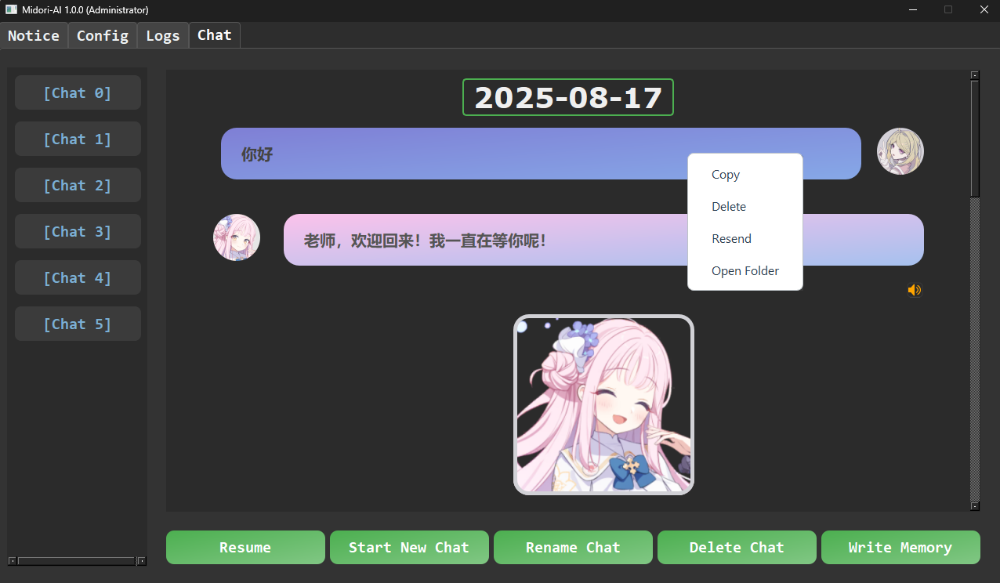

<div align="center">
<pre>
███╗   ███╗ ██╗ ██████╗  ╔██████╗  ██████╗  ██╗
████╗ ████║ ██║ ██╔══██╗ ██╔═══██╗ ██╔══██╗ ██║
██╔████╔██║ ██║ ██║  ██║ ██║   ██║ ██████╔╝ ██║
██║╚██╔╝██║ ██║ ██║  ██║ ██║   ██║ ██╔══██╗ ██║
██║ ╚═╝ ██║ ██║ ██████╔╝ ╚██████╔╝ ██║  ██║ ██║
╚═╝     ╚═╝ ╚═╝ ╚═════╝   ╚═════╝  ╚═╝  ╚═╝ ╚═╝
</pre>
</div>

---

# 📖 MIDORI 说明书

欢迎使用 Midori！这是一款功能丰富的 AI 桌面宠物聊天应用。

请仔细阅读本说明书，以了解 Midori 的全部功能。

---

## 🛒 购买地址

（暂未发布）

---

## 📚 目录

- [MIDORI 简介](#midori-简介)
    - [🚀 快速开始](#-快速开始)
    - [✨ 功能一览](#-功能一览)
- [💖 内置角色](#-内置角色)
- [🖥️ 软件界面](#️-软件界面)
- [🤖 大模型配置](#-大模型配置)
    - [方案一：配置 Gemini](#方案一配置-Gemini)
    - [方案二：配置第三方中转站](#方案二配置第三方中转站)
    - [方案三：配置 DeepSeek (不推荐)](#方案三配置-deepseek-不推荐)
- [🧠 长期记忆配置](#-长期记忆配置)
    - [方案一：ChatMika (本地记忆)](#方案一chatmika-本地记忆)
    - [方案二：memU (云端记忆)](#方案二memu-云端记忆)
- [😂 表情包配置](#-表情包配置)
- [🎤 接入 Fish Audio](#-接入-fish-audio)
- [🎵 BGM 播放](#-bgm-播放)
- [💾 从旧版本 Midori 导入数据](#-从旧版本-midori-导入数据)

<br>

## MIDORI 简介

### 🚀 快速开始

1. **[获取大模型 API](#-大模型配置)**
2. **在设置界面导入角色卡**
3. **开始聊天！**

### ✨ 功能一览

- **🎴 角色卡系统**：将角色所有数据（人设/Live2D/模型权重...）打包成单个 `.png` 文件，方便导入与分享。
- **🎤 语音合成模块**：内置高性能的 **Genie Pro** 本地推理引擎，语音自然逼真。
- **💃 Live2D 模块**：支持各种 Live2D 格式，让角色动起来。
- **🧠 长期记忆模块**：让角色记住与你的点滴，建立更深的情感连接。
- **😂 表情包模块**：角色可以发送表情包。
- **🌐 反向代理**：无需 VPN 也可直连官方 **Gemini**。

<br>

## 💖 内置角色

Midori 内置了以下初始角色，均支持本地语音，开箱即用。

<p align="center">
  
</p>
<p align="center">
  
</p>

<br>

## 🖥️ 软件界面

#### ⚙️ 设置界面

> **💡 提示**：将鼠标悬停在设置项上，会显示该功能的详细说明。
<p align="center">
  
</p>

#### 📝 日志界面

用于排查程序运行中可能出现的错误。开启 `调试模式` 后，这里会输出更详细的信息。
<p align="center">
  
</p>

#### 👤 角色选择界面

**右键点击**角色卡片可打开快捷菜单，进行删除、导出或置顶等操作。
<p align="center">
  
</p>

#### 📜 聊天记录界面

- **右键**返回上个界面。
- **右键**任意消息可打开快捷菜单，进行复制、删除、重发等操作。

<p align="center">
  
</p>

#### 💬 聊天界面

- **右键**返回上个界面。
- 使用 `Shift + Enter` 快捷键发送消息。
- 点击 `相册按钮` 可添加图片，**右键**图片可将其删除。
- 碧蓝档案的角色支持摸头。

> **⚠️ 注意**：`设置` > `大语言模型设置` > `大模型类型` 为 `Gemini` 时，才能识别图片内容。

<p align="center">
  
</p>

#### 🐾 桌宠模式

1. **启用模式**：在 `设置` > `桌宠模式设置` 中，勾选 `启用桌宠模式`。
2. **隐藏背景**：建议同时在 `设置` > `Live2D 设置` 中勾选 `消除场景` 以获得最佳效果。
3. **调整大小**：
    - 在 `设置` > `Live2D 设置` 中**取消勾选** `Live2D 窗口去边`。
    - 拖动窗口边缘调整至合适大小。
4. **操作技巧**：
    - 关闭输入框会同时关闭 `Live2D 窗口`。
    - **右键** `Live2D 窗口` 可以快速唤醒输入框。

<p align="center">
  
</p>

---

## 🤖 大模型配置

你必须为 AI 角色配置一个大语言模型 (LLM)。

---

### 方案一：配置 Gemini

Midori 已针对 Gemini 进行深度优化，我们强烈推荐您使用。

#### **获取 API-KEY**

1. 前往 [Google AI Studio 官网](https://aistudio.google.com/app/apikey)。
   如果跳转到页面 `Google AI Studio 和 Gemini API 的适用区域`，请更换网络节点。
2. 点击 `Create API key`。如果您没有 Google Cloud 项目，根据引导创建一个即可。
3. 复制生成的 API 密钥 (通常以 `AIzaSy...` 开头)。

> 如果您没有 VPN，可以在淘宝等电商平台搜索 "Gemini API" 关键字购买，价格通常很便宜。

#### 调整 Midori 的 `设置` > `大语言模型设置`

1. `大模型类型`：选择 `Gemini`
2. `大模型名称`：填入 `gemini-2.5-flash`
3. `API-KEY`：粘贴你获取的 API 密钥
4. `启用反向代理`：**勾选** (如果您没有开启 VPN)

> **⚠️ 版本提示**  
> 本教程编写于 2025 年 9 月。未来 Google
> 可能会更新模型版本。您可以在 [Google AI 官方文档](https://ai.google.dev/gemini-api/docs/models) 查看所有可用模型。

> **⚠️ 反向代理的局限性**  
> 我们发现，Cloudflare 可能会将请求路由到不支持 Gemini 服务的地区(例如香港)。  
> 这可能会导致如下报错: `User location is not supported for the API use.`  
> 如果您经常遇到这个问题，原因很可能与您所在的地理位置有关，短期内难以解决。  
> 手动创建自己的 [Cloudflare AI Gateway](https://developers.cloudflare.com/ai-gateway/get-started/)
> ，有可能会改善这一情况。  
> (1) 按照页面提示创建自己的 `AI Gateway`，建议使用默认参数。  
> (2) 创建完成后，将你网关的 `API 端点` 复制到：`设置` > `大语言模型设置` > `代理服务器`  
> (3) API 端点示例格式如下：`https://gateway.ai.cloudflare.com/v1/[一串字符]/[你的网关名称]/`

---

### 方案二：配置第三方中转站

> 如果内置反向代理和 VPN 均不可用，再考虑此方案。

以下以 `毫秒API` 为例，其他中转站配置流程类似。

1. **注册充值**：访问 [毫秒API](https://api.holdai.top/register?aff=yQAS) 注册并充值少量金额 (如 1 元) 以激活账户。
2. **创建令牌**：进入 `令牌` 页面，点击 `新增令牌`，使用默认设置创建并复制它。

#### 调整 Midori 的 `设置` > `大语言模型设置`

1. `大模型类型`：选择 `OpenAI`
2. `大模型名称`：填入 `gemini-2.5-flash-nothinking` (或您想使用的其他模型)
3. `API-KEY`：粘贴您在中转站创建的令牌
4. `OpenAI基址`：填入 `https://api.holdai.top/` (或其他中转站的 Base URL)

---

### 方案三：配置 DeepSeek (不推荐)

> 优点是国内网络可稳定访问，缺点是响应速度太慢、限制严格。

1. **注册充值**：访问 [DeepSeek 开放平台](https://platform.deepseek.com/api_keys) 注册并充值任意金额。
2. **创建密钥**：点击 `Create new API key` 创建一个新密钥并复制。

#### 调整 Midori 的 `设置` > `大语言模型设置`

1. `大模型类型`：选择 `DeepSeek`
2. `大模型名称`：任意填写 (程序会自动使用 `deepseek-chat` 模型)
3. `API-KEY`：粘贴您创建的 API 密钥。

---

## 🧠 长期记忆配置

长期记忆能让角色记住历史对话，实现更连贯的交流。

---

### **方案一：ChatMika (本地记忆)**

这是一个轻量级的本地记忆模块。

* **优点** 👍
    * **高召回率**：能记住丰富的对话细节。
    * **高度可视化**：记忆以日记形式保存，用户可随时查看和编辑。
* **缺点** 👎
    * **消耗 Token**：每次对话会发送全部记忆，可能消耗较多 Token。

#### **配置与使用**

1. 在 `设置` > `记忆模块` 中，勾选 `启用长时记忆`。
2. 将 `记忆模块类型` 选择为 `chatmika(本地)`。
3. 在 `聊天记录界面`，选择你想让角色记住的对话，点击 `Write Memory` 按钮。
4. 操作成功后，角色在新会话中也能回忆起这些内容。

> 如果聊天记录有更新，可以再次执行 `Write Memory`，程序会智能地将新增内容补充到记忆中。

> 记忆文件位于 `[Midori文件夹]\UserData\Memory\[角色名]\memory_chatmika.txt`，您可以随时手动编辑。当文件过大时，程序会自动截取最近的记忆发送。

---

### **方案二：memU (云端记忆)**

这是一个开源的云端长期记忆项目。

* **优点** 👍
    * **云端存储**：提供低延迟的云端记忆服务。
    * **节省 Token**：每次只发送与当前对话最相关的记忆。
* **缺点** 👎
    * **召回率低**：有时即使给出关键字，角色也可能无法回想起相关细节。
    * **额外延迟**：每轮对话会增加一次网络请求。
    * **无法编辑**：用户不能直接编辑记忆内容。

#### **配置与使用**

1. 前往 [memU 官网](https://app.memu.so/api-key) 注册并获取 API 密钥。
2. 在 Midori 的 `设置` > `记忆模块` 中，勾选 `启用长时记忆`。
3. `记忆模块类型` 选择 `memU(云端)`。
4. 将获取的密钥填入 `memU API`。
5. 在 `聊天记录界面` 写入记忆。您也可以在 [memU 记忆库](https://app.memu.so/memory) 查看角色记忆。

---

## 😂 表情包配置

1. **启用功能**
   在 `设置` > `表情包设置` 中，勾选 `启用表情包`。

2. **添加图片**
   将表情包图片 (如 `.png`, `.jpg`, `.gif`) 放入指定文件夹：
    * **角色专属** 📁 (仅特定角色使用)
      `[Midori文件夹]\Data\character_resource\[角色名]\stickers`
    * **全局通用** 📂 (所有角色共享)
      `[Midori文件夹]\Data\common_resource\common_stickers`

> **💡 命名技巧**
> 为了让 AI 理解并正确使用表情包，**请用描述性的词语为图片命名**，中英文均可。例如：`开心.png`、`sad.gif`。
> <p align="center"></p>

---

## 🎤 接入 Fish Audio

> **⚠️ 重要提示**
>
> - 目前 Fish Audio 生成**日语**语音的效果不如内置的 Genie 引擎。
> - 此功能需要角色卡内已配置 `fish_audio.json` 文件，否则将自动回退到 Genie 引擎。

如果角色卡未提供此配置，可按以下步骤手动添加：

1. **创建配置文件** ✍️
   在角色目录下创建 `fish_audio.json` 文件。
   **路径**：`[Midori文件夹]\Data\character_resource\[角色名]\tts\fish_audio.json`

2. **获取模型 ID** 🔗
   前往 [Fish Audio 模型广场](https://fish.audio/zh-CN/app/discovery/)，找到喜欢的声音模型并复制其 **模型ID**。

3. **编辑配置文件** ✍️
   用文本编辑器打开 `fish_audio.json`，填入以下内容，并将占位符替换为你的模型 ID：
   ```json
   {
     "reference_id": "[此处填写你的模型ID]"
   }
   ```

4. **配置 API 密钥** 🔑
    - 前往 [Fish Audio API 页面](https://fish.audio/zh-CN/app/api-keys/) 注册、充值并创建一个 API 密钥。
    - 在 Midori 的 `设置` > `语音合成设置` 中，将密钥填入 `Fish Audio API` 输入框。

---

## 🎵 BGM 播放

1. **设置音量**
   在 `设置` > `其他设置` 中，调整 `BGM 音量` (范围 1-100)。

2. **添加音乐**
   将一个或多个音乐文件 (如 `.mp3`, `.wav`) 放入以下文件夹：`[Midori文件夹]\Data\common_resource\sounds\bgm`

---

## 💾 从旧版本 Midori 导入数据

本部分将指导您如何将旧版本 Midori 的数据迁移至新版本。

### **导入聊天记录**

您可以直接将旧版的聊天记录文件复制到新版对应的文件夹中。

1. 找到旧版 Midori 的聊天记录，路径通常为：
   `[旧Midori文件夹]\UserData\ChatHistory\[角色名]\[聊天名]`
2. 复制到新版 Midori 的相同路径下即可：
   `[新Midori文件夹]\UserData\ChatHistory\[角色名]\[聊天名]`

### **导入记忆**

目前暂不支持一键导入旧版记忆，您需要通过手动编辑文件来迁移。

记忆文件位于 `[Midori文件夹]\UserData\Memory\[角色名]\memory_chatmika.txt`，其内容格式如下：

```
[YYYY-MM-DD]
这是一段记忆。
[YYYY-MM-DD]
这是另一段记忆。
...
```

> **💡 迁移技巧**
>
> 如果您的旧记忆文件内容较多，手动整理可能会非常耗时。
>
> **我们建议**：您可以将旧记忆文件的全部内容发送给任意一款大语言模型（如 Gemini），并要求它根据上述格式进行总结和提炼。最后，将模型生成的内容粘贴到新的
`memory_chatmika.txt` 文件中即可。
